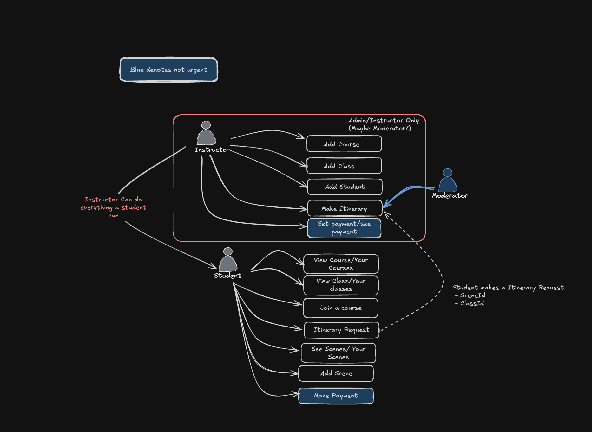

# Classm8

- A Deno based Acting Studio management application, complete with PostGres
  docker image as well as a React Front End that has Clerk Authentication.

## Running

- `docker-compose up` to start the docker container for postgres
- `deno install`
- `deno run dev`

## What's Currently Possible

- Sign in with Clerk to see main dashboard
- Create "Scene Request" for a class
- Create a "Course", which consists of One or many Classes
- Create a "Class", which consists of one or more Scenes, and an Instructor
- Create a "Scene", which consists of one or more Performers (actors)
- Track attendance for each class

## What's Needs to be done?

- Permission based rendering depending if you are a "STUDENT" |
  "MODERATOR"|"INSTRUCTOR"
- Ability to edit simple class details
- Stripe integration

